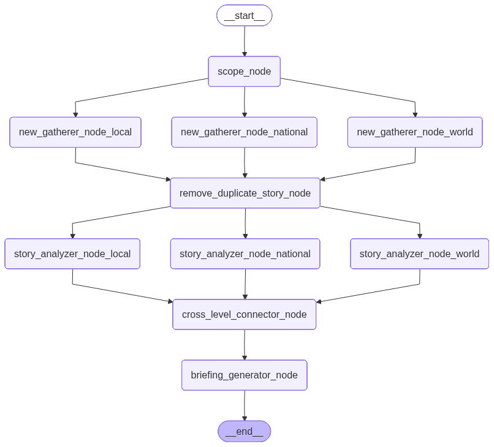

# Daily Brief

AI-powered daily news briefings that trace how global events ripple down to your local community.

[](https://github.com/oddbullet/daily-brief/actions/workflows/ci.yml)
[](https://github.com/oddbullet/daily-brief/actions/workflows/deploy.yml)

## What It Does

Daily Brief fetches and analyzes news across three scopes world, national, and local. It then generates a structured markdown briefing. The key feature is causal chain analysis: it identifies how a global event creates ripple effects at the national level, and how that national event affects your local area.

When deployed to AWS Lambda, the briefing is automatically emailed to you every morning with Amazon SES.

## Key Features

- **Causal chain tracing** — global news → national → local impact
- **Structured story analysis** — each story tagged with sentiment, threat level (none/low/medium/high), relevance score (1–10), and topic categories
- **Swappable LLM providers** — Groq, Ollama, or OpenRouter, each with a configured fallback model
- **Markdown output** — saved to `./save/` with structured filenames
- **AWS Lambda + SES** — automated daily email delivery

## Quick Start

**Requirements:** Python 3.13 and [uv](https://docs.astral.sh/uv/)

```bash
# 1. Clone and install
git clone https://github.com/oddbullet/daily-brief
cd daily-brief
uv sync

# 2. Configure API keys
cp .env.example .env

# 3. Run
brief
```

## Configuration

Copy `.env.example` to `.env` and fill in your keys:

| Variable                     | Required            | Description                                           |
| ---------------------------- | ------------------- | ----------------------------------------------------- |
| `TAVILY_API_KEY`             | Yes                 | [Tavily](https://tavily.com) search API key           |
| `GROQ_API_KEY`               | If using Groq       | [Groq](https://console.groq.com) API key              |
| `OPENROUTER_API_KEY`         | If using OpenRouter | [OpenRouter](https://openrouter.ai/) API key          |
| `OLLAMA_URL`                 | If using Ollama     | Ollama server URL (default: `http://localhost:11434`) |
| `PHOENIX_API_KEY`            | No                  | AI tracing and token tracking                         |
| `PHOENIX_COLLECTOR_ENDPOINT` | No                  | AI tracing and token tracking                         |

## Usage

```
brief [OPTIONS] COMMAND
```

| Flag                     | Default       | Description                                     |
| ------------------------ | ------------- | ----------------------------------------------- |
| `--location`, `-l`       | `"USA, Ohio"` | Location as `"Country, Local Area"`             |
| `--focus`, `-f`          | `"AI"`        | Topic(s) to research, comma-separated           |
| `--provider`, `-p`       | `openrouter`  | LLM provider: `groq`, `ollama`, or `openrouter` |
| `--save` / `--no-save`   | save          | Save output to `./save/`                        |
| `--cache` / `--no-cache` | cache         | Cache Tavily API responses to `./cache_tavily/` |

```bash
brief

# Oil and energy briefing for London
brief -l "UK, London" -f "Oil, Energy" -p groq
```

### Commands

| Command  | Description                                   |
| -------- | --------------------------------------------- |
| `config` | Open `daily_brief/config.yaml` in your editor |

## Output Format

Briefings are saved to `./save/`.

Each briefing contains:

- **Executive Summary** — 3–5 sentence synthesis across all scope levels
- **Cross-Level Connections** — explicit world → national → local causal chains
- **World / National / Local News** — analyzed stories each with sentiment, threat level, relevance, summary, and categories
- **What to Watch** — 2–3 developing stories to monitor

## AWS Deployment

Daily Brief runs as a scheduled AWS Lambda function that emails the briefing each morning via Amazon SES.

### Architecture

- **Lambda** — runs the briefing pipeline
- **EventBridge** — triggers the function daily at 11:00 AM UTC
- **SES** — delivers the briefing as an email

## How It Works

The pipeline is built on [LangGraph](https://github.com/langchain-ai/langgraph):



1. **Scope Node** — runs an initial search to define tailored research directives for each scope level
2. **News Gatherer** — fetches stories via Tavily for each scope in parallel
3. **Remove Duplicate Stories** — deduplicates by URL, prioritising world > national > local when the same story appears across scopes
4. **Story Analyzer** — analyzes each story for sentiment, threat level, relevance score, and categories
5. **Cross-Level Connector** — identifies causal chains linking world events to national and local impacts
6. **Briefing Generator** — synthesizes everything into the final markdown briefing
